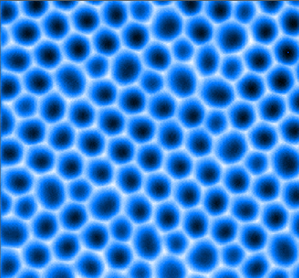
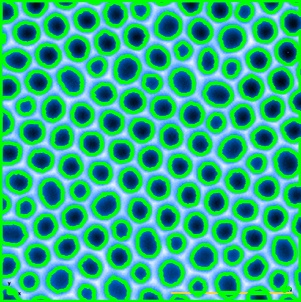
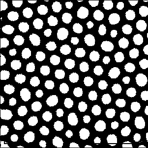
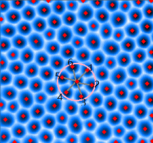
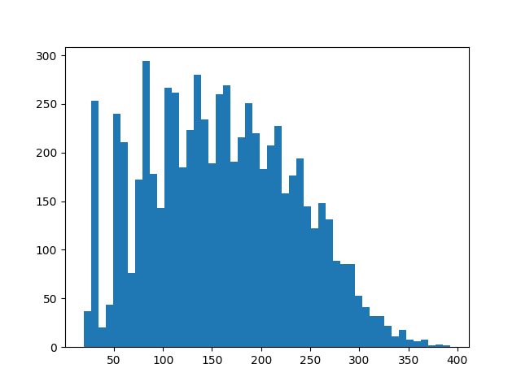
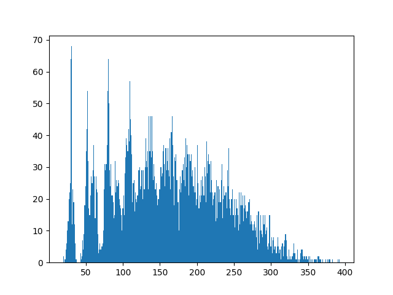
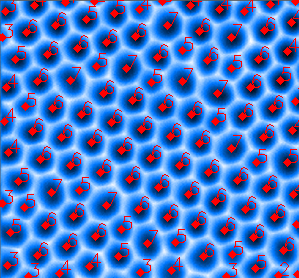

# Contour-shape-detection

## 格点识别

这个项目主要用于解决扫描图像中类似石墨烯的网格中的结构识别和统计问题。需要处理的图像如下图所示：

如何能抓住这些结构呢，首先用`cv2`中的`findContours`方法找出图像蓝色(红色？)分量中的边界位置。这个步骤得到的图像如下图所示。

接着对图像进行二值化操作，保存成单色的图像。

接着再次使用`findContours`方法，将所有边界提取出来，并把边界上的点取平均值，可以得到圆圈的中心点坐标。

我们知道，每两个边界的形成都是由两个圆球块挤压形成的，这样只要统计每个圆球周围圆球的个数就可以知道圆球的边界数（如上图所示）。

## 圆环边数统计

我们使用`itertools.combinations`对所有的点进行全组合，两两计算他们的距离，那么落在第一个极大值区间内的，就是平均的格点间距离。（对于数目较大的可以使用傅里叶变换。）

通过初步的统计，发现30、55、80是前三个极大值峰，那么格点之间的平均距离落在25~30之间。一些过小的值应该被视为识别偏差，通常在图片边缘出现，他们比图像中的信息小一个量级。

如果格子的周期性比较好，可以对单个距离进行统计，结果会更加清晰，如下图所示。

应用过滤器，找到最小的峰值上下浮动`threshold=0.7`时，即为最近邻的格点。结果如下图所示。

## 涂色

为了清晰的标记不同圆环，我们对圆环进行上色。
首先对所有七圆环上色，涂上颜色A。接着对五圆环涂色，涂上颜色B，接着对七圆环和五元环周围的六元环涂上颜色C，最后把剩下的六元环涂上颜色D。

为了更方便的处理圆环的关系，我决定用一个圆环类来处理这些数据。这个类记录了近邻数目、位置、自己的圆环属性、颜色属性、边界等等，方便进一步处理。